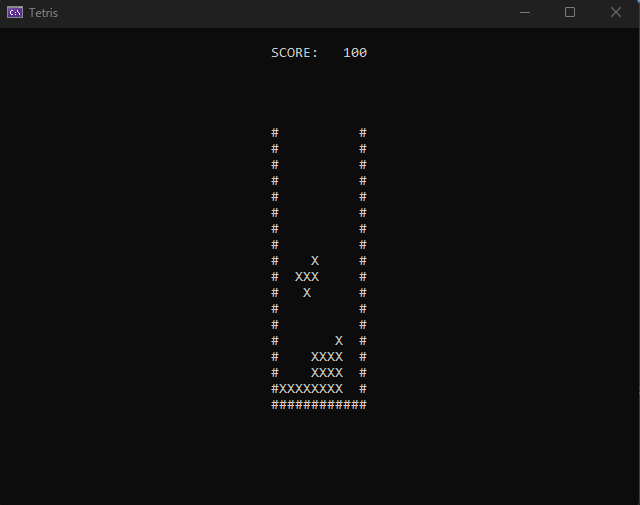
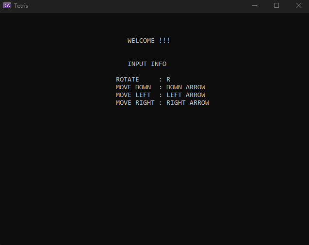
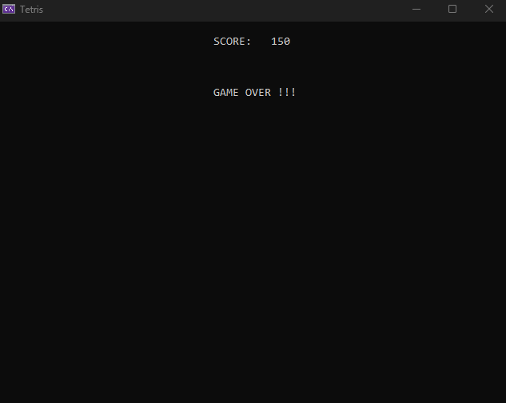

<h1 align="center">Windows Console Tetris</h1>
 

    

 

This project is a simple implementation of the classic Tetris game in C++ using the Windows API for console-based graphics. 
It provides a basic Tetris gaming experience where you can control tetrominos, clear lines, and accumulate points.

Believe it or not, there's even a 'welcome' screen and a 'game over' screen in the game.

    
    

